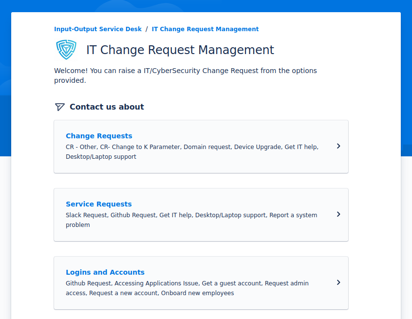

## Authors

Samuel Evans-Powell

## Status

`PROPOSED`{.lightyellow}

## Abstract

Developers directly receiving work from others in the company is disruptive and subverts team processes, putting undue stress on the individual (rather than the team).

The following document outlines a process which puts agency back in the hands of the team, and helps prevent poor quality tickets from reaching the sprint backlog.

## Introduction

- Developers are often pinged on Slack for work.
- Puts undue stress on individual.
- Subverts sprint planning/sprint goal/etc.
- Team doesn't get full idea of it's responsibilities.
- Creates unrealistic expectations for others around when work can be completed.
We move at a given pace due to our processes, and the process for accepting work should reflect that pace back to the others.
Reduce "get this done tomorrow" incidents.
- Poor quality tickets.
- Conversation and requirements too often captured in ephemeral Slack.
- Not always clear to others what products Adrestia looks after.
- Introduce some request for work ticket system that:
    - Allows team members to direct others to the ticket system to submit work.
    - Allows others and team members to go back and forth about requirements (must email others).
    - Gives others detailed information about when a ticket has been accepted, scheduled, completed etc.
    - Integrates with Jira.

```
Intention:

others
↕
managers
↕
developers

---------------------------
Actual:

others    others
↕         ↕
managers  ↕
↕         ↕
developers

---------------------------
ACP-002:

others    others
↕         ↕
managers  | acp-002
↕         ↕
developers
```

We aren't the only team to face this.
The IT team faces a similar issue, but more pronounced.
They implemented a ticketing system:



### Process nitty gritty

Tickets should be submitted under a product.
If another believes the ticket doesn't fit under an existing product, but that we are still responsible, pay special attention.

  - Attempt to classify the ticket under a new product, and add the product to the ticketing system.
    - Classify the new ticket under that product.
  - If the ticket is not our responsibility, refer the other to the correct party and reject the ticket.
  - If the ticket is truly miscellaneous, you may 
